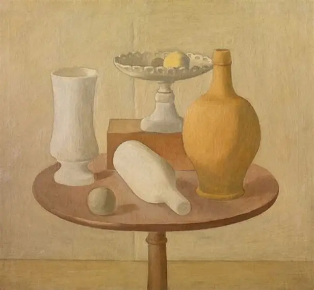
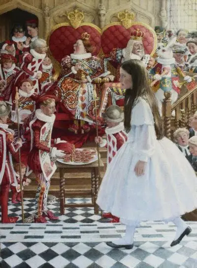
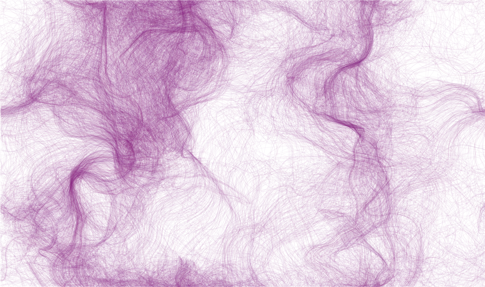

# Quiz 8 - Design Research

## Part 1: Imaging Technique Inspiration

### Chosen Technique: [p5js on pattern]
**Example Source:** [The first artwork is based on the visual style and composition, this painting is a masterpiece by the renowned artist Giorgio Morandi.]
**Example Source:**[The second one is from a famous movie called "Alice in Wonderland"]

[Use different patterns to make puzzle effects, and there are random motion effects.
]

#### Visual Reference

---

## Part 2: Coding Technique Exploration

### Implementation Strategy: [Perlin Noise]

[The canvas is divided into several small squares as a vector field. Each small square is used as a vector according to the gradient direction generated by Berlin noise. The acceleration of the particles is the vector in the small square that is currently moving. With the change of time, the vector field changes regularly. The trajectory of particle motion is a regular curve, and the motion curves of several particles are combined into beautiful images.]

#### Code Demonstration

**Example Implementation:**
*   [https://github.com/lxcnju/perlin_noise_flowfields]
*   [https://github.com/lxcnju/perlin_noise_flowfields/blob/master/README.md](代码仓库或源文件链接)

